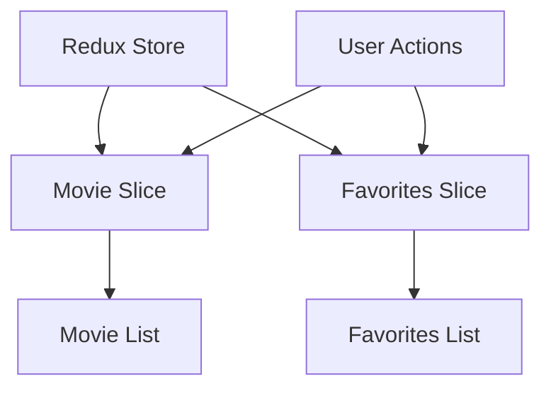

# MovieTime 🎬

A modern React-based movie browsing application with user authentication and favorite movies functionality.

## 🛠 Technology Stack

| Category | Technologies |
|----------|-------------|
| Frontend Framework |  |
| Build Tool |  |
| State Management |  |
| Styling |  |
| Authentication |  |
| Routing | React Router DOM |
| UI Components | React Bootstrap |

## 🗺 Project Structure

```
movieTime/
├── src/
│   ├── components/
│   │   ├── Categories/
│   │   ├── DetailedMovie/
│   │   ├── Favorites/
│   │   ├── Login/
│   │   ├── Movies/
│   │   ├── Navbar/
│   │   └── Signup/
│   ├── services/
│   │   ├── auth.js
│   │   └── firebase.js
│   ├── store/
│   │   └── Store.js
│   └── App.jsx
└── package.json
```

## ⚙️ Core Features

| Feature | Description |
|---------|-------------|
| 🎥 Movie Browsing | Browse through a collection of movies with detailed information |
| 🔐 Authentication | User registration and login using Firebase |
| ❤️ Favorites | Add/remove movies to favorites list (requires authentication) |
| 🎨 Theme Toggle | Switch between light and dark themes |
| 📱 Responsive Design | Fully responsive layout for all screen sizes |

## 🚀 Getting Started

1. Clone the repository
```bash
git clone https://github.com/nihalsabri/MovieTime-website-using-React.git
```

2. Install dependencies
```bash
npm install
```

3. Start development server
```bash
npm run dev
```

## 🔒 Protected Routes

| Route | Access |
|-------|---------|
| `/` | Public |
| `/movies` | Public |
| `/categories` | Public |
| `/favorites` | Protected (Requires Login) |
| `/login` | Public |
| `/signup` | Public |

## 🎯 State Management



## 🌐 API Integration

- Movies data fetched from external API
- Authentication handled through Firebase
- State managed with Redux for seamless updates

## 🎨 Theme Support

- Light/Dark mode toggle
- Persistent theme selection
- Bootstrap-based styling

## 📱 Responsive Design

- Mobile-first approach
- Breakpoints for all devices
- Flexible grid system

